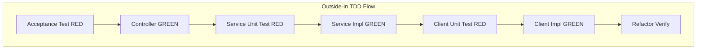

# Problem 1: God Analysis API Implementation Plan

## Requirements Summary

**User Story:** As an API consumer, I want to consume God APIs (Greek, Roman, Nordic), filter gods whose names start with 'n', convert each filtered god name into a decimal representation, and return the sum of those values for cross-pantheon analysis.

**Key Business Rules:**

- **Decimal Conversion:** Each character in a god name is converted to its Unicode code point; values are concatenated as strings per name (e.g., "Zeus" → Z(90)e(101)u(117)s(115) → "90101117115"). The final result is the sum of all such per-name concatenated values (as `BigInteger` to support large numbers).
- **Filtering:** Case-insensitive matching for names starting with 'n' (e.g., Nike, Nemesis, Njord). Per [god-api.yaml](https://github.com/jabrena/latency-problems/blob/master/docs/problem1/god-api.yaml). Note: Gherkin says case-sensitive; follow OpenAPI spec.
- **Timeout:** 5 seconds per upstream call. If a call times out, proceed with successfully retrieved lists.
- **Expected result:** With `filter=n` and `sources=greek,roman,nordic`, sum = `"78179288397447443426"`.

**API Contract:**

- **Internal API** ([god-api.yaml](https://github.com/jabrena/latency-problems/blob/master/docs/problem1/god-api.yaml)): `GET /api/v1/gods/stats/sum`, query params `filter` (optional), `sources` (optional, comma-separated: greek, roman, nordic).
- **External APIs** ([my-json-server-oas.yaml](https://github.com/jabrena/latency-problems/blob/master/docs/problem1/my-json-server-oas.yaml)): Arrays of strings from `/greek`, `/roman`, `/nordic` at `https://my-json-server.typicode.com/jabrena/latency-problems`.

---

## Approach: London Style Outside-In TDD

Work from the outside (API contract) inward (controller → service → client). Each layer is driven by tests first.

---

## Task List (Execution Order)

| #   | Phase    | Task                                                                                                                                                                                        | TDD  | Status |
| --- | -------- | ------------------------------------------------------------------------------------------------------------------------------------------------------------------------------------------- | ---- | ------ |
| 1   | Setup    | Add RestAssured, WireMock, Mockito to [examples/problem1/pom.xml](examples/problem1/pom.xml); add `server.servlet.context-path=/api/v1` and external API config to `application.properties` |      |        |
| 2   | Setup    | Create `SumResponse` record, `GodsStatsController`, and empty `GodAnalysisService` interface                                                                                                |      |        |
| 3   | RED      | Write integration test (RestAssured + WireMock) for happy path: filter=n, sources=greek,roman,nordic → 200, sum=78179288397447443426                                                        | Test |        |
| 4   | GREEN    | Implement controller delegating to service; implement service and `UpstreamGodClient` (RestClient) to satisfy test                                                                          | Impl |        |
| 5   | RED      | Write unit test for `DecimalConverter`: "Zeus" → "90101117115", "Nike" → "78107101101"                                                                                                      | Test |        |
| 6   | GREEN    | Implement `DecimalConverter` utility                                                                                                                                                        | Impl |        |
| 7   | RED      | Write unit test for filter logic: case-insensitive prefix match (Nike, Nemesis, Njord included; Zeus excluded)                                                                              | Test |        |
| 8   | GREEN    | Implement `GodFilter` or inline logic in service                                                                                                                                            | Impl |        |
| 9   | RED      | Write unit test for `GodAnalysisService` with mocked `UpstreamGodClient`                                                                                                                    | Test |        |
| 10  | GREEN    | Complete service orchestration: fetch → filter → convert → sum                                                                                                                              | Impl |        |
| 11  | RED      | Write client unit test with WireMock stub for `/greek`                                                                                                                                      | Test |        |
| 12  | GREEN    | Implement `UpstreamGodClient` with RestClient, 5s timeout, configurable base URL                                                                                                            | Impl |        |
| 13  | Refactor | Add timeout-handling: if upstream fails, proceed with available lists; 504 when all fail                                                                                                    |      |        |
| 14  | Refactor | Extract config to `@ConfigurationProperties`; add tests for timeout and partial failure; run `./mvnw -pl examples/problem1 clean verify`                                                    |      |        |

---

## Execution Instructions

When executing this plan:

1. Complete the current task.
2. **Update the Task List**: set the Status column for that task (e.g., ✔ or Done).
3. Only then proceed to the next task.
4. Repeat for all tasks. Never advance without updating the plan.

---

## File Checklist (TDD Order)

| Order | File                                                                                                                       | When                         |
| ----- | -------------------------------------------------------------------------------------------------------------------------- | ---------------------------- |
| 1     | [examples/problem1/pom.xml](examples/problem1/pom.xml)                                                                     | Setup — add deps             |
| 2     | [examples/problem1/src/main/resources/application.properties](examples/problem1/src/main/resources/application.properties) | Setup — context path, config |
| 3     | `examples/problem1/src/main/java/com/example/demo/gods/SumResponse.java`                                                   | Setup — record               |
| 4     | `examples/problem1/src/main/java/com/example/demo/gods/GodsStatsController.java`                                           | Setup — skeleton             |
| 5     | `examples/problem1/src/main/java/com/example/demo/gods/GodAnalysisService.java`                                            | Setup — interface            |
| 6     | `examples/problem1/src/test/java/com/example/demo/gods/GodsStatsApiTest.java`                                              | RED — integration test       |
| 7     | `examples/problem1/src/main/java/com/example/demo/gods/UpstreamGodClient.java`                                             | GREEN — client               |
| 8     | `examples/problem1/src/main/java/com/example/demo/gods/GodAnalysisServiceImpl.java`                                        | GREEN — service impl         |
| 9     | `examples/problem1/src/test/java/com/example/demo/gods/DecimalConverterTest.java`                                          | RED — converter test         |
| 10    | `examples/problem1/src/main/java/com/example/demo/gods/DecimalConverter.java`                                              | GREEN — converter            |
| 11    | `examples/problem1/src/test/java/com/example/demo/gods/GodAnalysisServiceTest.java`                                        | RED — service unit test      |
| 12    | `examples/problem1/src/test/java/com/example/demo/gods/UpstreamGodClientTest.java`                                         | RED — client test            |

---

## Notes

- **Package layout:** `com.example.demo.gods` for controller, service, client, DTOs, and utilities.
- **Decimal conversion:** Use `BigInteger` for the sum to support values like `78179288397447443426`.
- **Spec discrepancy:** Gherkin says "case-sensitive (only lowercase 'n')"; god-api.yaml and README say case-insensitive. Use case-insensitive to match expected sum and OpenAPI spec.
- **Upstream base URL:** `https://my-json-server.typicode.com/jabrena/latency-problems`; paths `/greek`, `/roman`, `/nordic`.
- **Spring Boot Modulith:** Omitted for simplicity; can be added later if modular boundaries are required.
- **JUnit:** Parent uses JUnit 6 (6.0.1); Spring Boot 4.0.3 may bring its own. Ensure compatibility.

