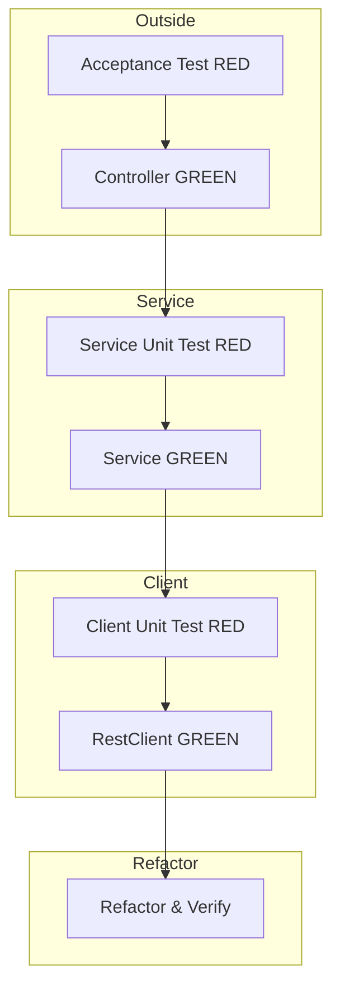

# Problem 1: God Analysis API Implementation Plan

## Requirements Summary

**User Story:** As an API consumer / data analyst, I want to consume God APIs (Greek, Roman & Nordic), filter gods whose names start with 'n', convert each filtered god name into a decimal representation, and return the sum of those values, so that I can perform cross-pantheon analysis and aggregate mythology data.

**Key Business Rules:**

- **Decimal Conversion:** Each character in a god name is converted to its Unicode code point. These values are concatenated as strings per name (e.g., "Zeus" → Z(90)e(101)u(117)s(115) → "90101117115"). The final result is the sum of all such per-name concatenated values (as a string to support large numbers).
- **Filtering:** Case-insensitive matching for names starting with the filter character (e.g., filter=n matches "Nike", "Nemesis", "Njord").
- **Sources:** Optional query param `sources` (comma-separated: greek, roman, nordic). When omitted, all sources are used.
- **Filter:** Optional query param `filter` (single character). When omitted, all gods from selected sources are summed.
- **Timeout:** API call timeout of 5 seconds. If an upstream call times out, the calculation proceeds with successfully retrieved lists only.
- **Expected result (happy path):** `GET /gods/stats/sum?filter=n&sources=greek,roman,nordic` returns `{"sum":"78179288397447443426"}`.

**Internal API (god-api.yaml):**

- `GET /api/v1/gods/stats/sum`
- Query params: `filter` (optional, string, minLength 1, maxLength 1), `sources` (optional, array of greek|roman|nordic)
- Response 200: `{"sum": "<string>"}`

**External APIs (my-json-server-oas.yaml):**

- Base: `https://my-json-server.typicode.com/jabrena/latency-problems`
- `GET /greek` → array of god names (strings)
- `GET /roman` → array of god names (strings)
- `GET /nordic` → array of god names (strings)

---

## Approach: London Style Outside-In TDD

Implement outside-in: acceptance test → controller → service unit tests → service → upstream client tests → client implementation.

---

## Task List (London Style Order)

**Parallelization:** agent-developer-1 and agent-developer-2 can work in parallel on tasks 3–8 after setup (1–2). agent-developer-1 creates `GodAnalysisService` interface + `FakeGodAnalysisService` (hardcoded `"78179288397447443426"`) so the controller and acceptance test can pass before agent-developer-2 finishes. Task 9 swaps fake for real implementation.

| #   | Phase    | Task                                                                                                                                    | TDD  | Status | Agent             |
| --- | -------- | --------------------------------------------------------------------------------------------------------------------------------------- | ---- | ------ | ----------------- |
| 1   | Setup    | Add RestClient, WireMock, RestAssured, Mockito to `examples/problem1/pom.xml`                                                           |      |        | agent-developer-1 |
| 2   | Setup    | Configure `application.properties`; create `GodAnalysisService` and `UpstreamGodClient` interfaces (empty) to unblock agent-developer-2 |      |        | agent-developer-1 |
| 3   | RED      | Write RestAssured integration test: GET `/gods/stats/sum?filter=n&sources=greek,roman,nordic` with WireMock stubs                       | Test |        | agent-developer-1 |
| 4   | GREEN    | Create `GodStatsController`, `SumResponse` record, `FakeGodAnalysisService`; delegate controller to service                             | Impl |        | agent-developer-1 |
| 5   | RED      | Write unit tests for `GodAnalysisService`: filter, decimal conversion, sum logic                                                        | Test |        | agent-developer-2 |
| 6   | GREEN    | Implement `GodAnalysisServiceImpl` with filter + decimal conversion + sum                                                               | Impl |        | agent-developer-2 |
| 7   | RED      | Write unit tests for `UpstreamGodClient` (RestClient) with WireMock                                                                     | Test |        | agent-developer-2 |
| 8   | GREEN    | Implement `UpstreamGodClient` fetching /greek, /roman, /nordic                                                                          | Impl |        | agent-developer-2 |
| 9   | Refactor | Replace `FakeGodAnalysisService` with real impl; wire client into service; add timeout handling; verify acceptance                      |      |        | agent-developer-1 |
| 10  | Refactor | Run `./mvnw -pl examples/problem1 clean verify` and fix any issues                                                                      |      |        | agent-developer-1 |

---

## Execution Instructions

When executing this plan:

1. Complete the current task.
2. **Update the Task List**: set the Status column for that task (e.g., ✔ or Done).
3. Only then proceed to the next task.
4. Repeat for all tasks. Never advance without updating the plan.

**With 2 agents:**

- **agent-developer-1:** Run tasks 1 → 2 → 3 → 4 (sequential), then wait for agent-developer-2. After agent-developer-2 completes 5–8, run tasks 9 → 10.
- **agent-developer-2:** Wait for agent-developer-1 to complete tasks 1–2 (setup). Then run tasks 5 → 6 → 7 → 8 (sequential) in parallel with agent-developer-1’s 3–4.

---

## File Checklist (London Style Order)

| Order | File                                                                          | When (TDD)                                     |
| ----- | ----------------------------------------------------------------------------- | ---------------------------------------------- |
| 1     | `examples/problem1/pom.xml`                                                   | Setup — deps                                   |
| 2     | `examples/problem1/src/main/resources/application.properties`                 | Setup — config                                 |
| 3     | `examples/problem1/src/main/java/.../GodAnalysisService.java`                 | Setup — interface (unblocks agent-developer-2) |
| 4     | `examples/problem1/src/main/java/.../client/UpstreamGodClient.java`           | Setup — interface (unblocks agent-developer-2) |
| 5     | `examples/problem1/src/test/java/.../GodStatsApiIntegrationTest.java`         | RED — acceptance                               |
| 6     | `examples/problem1/src/main/java/.../web/SumResponse.java`                    | GREEN — DTO                                    |
| 7     | `examples/problem1/src/main/java/.../web/GodStatsController.java`             | GREEN — controller                             |
| 8     | `examples/problem1/src/test/java/.../GodAnalysisServiceTest.java`             | RED — service unit                             |
| 9     | `examples/problem1/src/main/java/.../GodAnalysisServiceImpl.java`             | GREEN — service impl                           |
| 10    | `examples/problem1/src/test/java/.../UpstreamGodClientTest.java`              | RED — client unit                              |
| 11    | `examples/problem1/src/main/java/.../client/RestClientUpstreamGodClient.java` | GREEN — client impl                            |

---

## Notes

- **Target module:** `examples/problem1` (Spring Boot 4.0.3, Java 25).
- **Package layout:** `com.example.demo` or similar; keep `web`, `service`, `client` subpackages.
- **Decimal conversion formula:** For each god name, `name.chars().mapToObj(Character::toString).map(c -> String.valueOf((int) c.charAt(0))).reduce("", String::concat)` then parse as BigInteger and sum. Use `BigInteger` for the final sum to support large values.
- **Filter behavior:** Apply lowercase only for filtering (e.g., `name.toLowerCase().startsWith(filter.toLowerCase())`); keep original name for decimal conversion.
- **Case sensitivity discrepancy:** god-api.yaml and README say case-insensitive; Gherkin says case-sensitive for 'n'. This plan follows god-api.yaml (case-insensitive).
- **WireMock:** Stub `GET /greek`, `GET /roman`, `GET /nordic` with realistic JSON arrays in integration tests.
- **Timeout:** Configure `RestClient` with 5s timeout; handle `HttpClientErrorException` / timeout by excluding failed sources from the sum.

