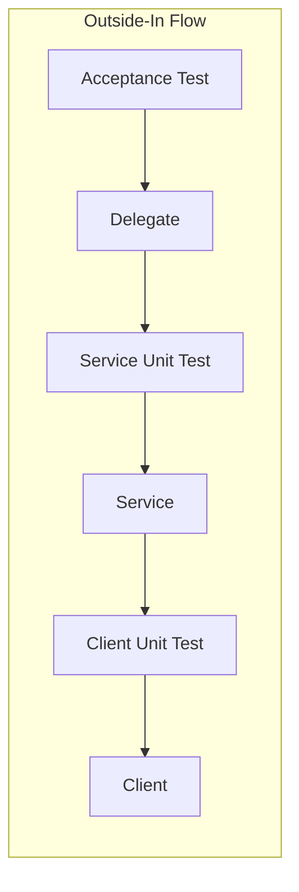

# Problem 1: Cross-Pantheon God Analysis API Implementation Plan

## Requirements Summary

**User Story:** Consume God APIs (Greek, Roman, Nordic), filter gods whose names start with 'n' (case-insensitive), convert each filtered name to a decimal representation, and return the sum.

**Key Business Rules:**

- **Decimal conversion:** For each god name, convert each character to its Unicode code point, concatenate as strings (e.g., "Zeus" → "90101117115"), then sum all per-name values. Use `BigInteger` for large numbers.
- **Filtering:** Case-insensitive prefix match (e.g., "Nike", "Nemesis", "Njord").
- **Timeout:** 5 seconds per upstream call; if timeout occurs, proceed with successfully retrieved lists.
- **Expected sum** (filter=n, sources=greek,roman,nordic): `78179288397447443426`

---

## London Style (Outside-In) TDD Approach

Work from the **outside** (acceptance test) **inward** (delegate → service → client). Each layer: **RED** (write failing test) → **GREEN** (minimal implementation) → **REFACTOR**.

---

## Task List (London Style TDD Order)

| #   | Phase    | Task                                                                                                                       | TDD  | Status |
| --- | -------- | -------------------------------------------------------------------------------------------------------------------------- | ---- | ------ |
| 1   | Setup    | Copy OpenAPI specs (god-api.yaml, my-json-server-oas.yaml) to `src/main/resources/openapi/`                                |      |        |
| 2   | Setup    | Add openapi-generator-maven-plugin with 2 executions + build-helper-maven-plugin to pom.xml                                |      |        |
| 3   | Setup    | Add dependencies: Modulith, RestClient, WireMock, RestAssured, jackson-databind-nullable                                   |      |        |
| 4   | Setup    | Run `mvn generate-sources` and verify generated code                                                                       |      |        |
| 5   | Setup    | Create `info.jab.ms.Problem1Application`, package structure (api, service, config), application.properties                 |      |        |
| 6   | RED      | Write `GodStatsApiIntegrationTest` (RestAssured + WireMock) — happy path, expect sum=78179288397447443426                  | Test |        |
| 7   | GREEN    | Implement `CrossPantheonApiDelegateImpl` + `GodAnalysisService` with **fake** client (hardcoded Nike,Nemesis,Neptun,Njord) | Impl |        |
| 8   | RED      | Write `GodAnalysisServiceTest` (unit) — mock upstream client, verify decimal conversion, filtering, parallel fetch         | Test |        |
| 9   | GREEN    | Refactor `GodAnalysisService` — real logic, inject client interface; keep fake for now if needed                           | Impl |        |
| 10  | RED      | Write `UpstreamClientTest` (WireMock) — stub /greek, /roman, /nordic, verify generated client fetches correctly            | Test |        |
| 11  | GREEN    | Implement `UpstreamClientConfig`, wire real generated client; remove fake from service                                     | Impl |        |
| 12  | RED      | Add acceptance test: 500/504 when all upstream fail; edge cases (no filter, single source, timeout)                        | Test |        |
| 13  | GREEN    | Implement error handling (500/504), timeout handling (empty list per source on failure)                                    | Impl |        |
| 14  | Refactor | Verify `mvn clean verify`; align with Gherkin scenario                                                                     |      |        |

---

## File Checklist (London Style TDD Order)

| Order | File                                                 | When (TDD)                                           |
| ----- | ---------------------------------------------------- | ---------------------------------------------------- |
| 1     | `src/main/resources/openapi/god-api.yaml`            | Setup                                                |
| 2     | `src/main/resources/openapi/my-json-server-oas.yaml` | Setup                                                |
| 3     | `pom.xml`                                            | Setup (generator, deps, build-helper)                |
| 4     | `application.properties`                             | Setup                                                |
| 5     | `Problem1Application.java`                           | Setup (relocate from DemoApplication to info.jab.ms) |
| 6     | `GodStatsApiIntegrationTest.java`                    | **RED** — write first (failing)                      |
| 6     | `CrossPantheonApiDelegateImpl.java`                  | **GREEN** — implement to pass acceptance test        |
| 7     | `GodAnalysisService.java`                            | **GREEN** — with fake client initially               |
| 8     | `GodAnalysisServiceTest.java`                        | **RED** — write before refactoring service           |
| 9     | `UpstreamClientTest.java`                            | **RED** — write before wiring real client            |
| 10    | `UpstreamClientConfig.java`                          | **GREEN** — wire real client, remove fake            |
| 11    | (refactor) `GodAnalysisService.java`                 | **GREEN** — inject real client, add error handling   |

---

## Notes

- **Base package:** `info.jab.ms`. Single Modulith; upstream configuration lives in `config` package.
- **Upstream API format:** Each endpoint returns `["Zeus", "Hera", ...]` (array of strings).
- **TDD rule:** Never write production code without a failing test first.

