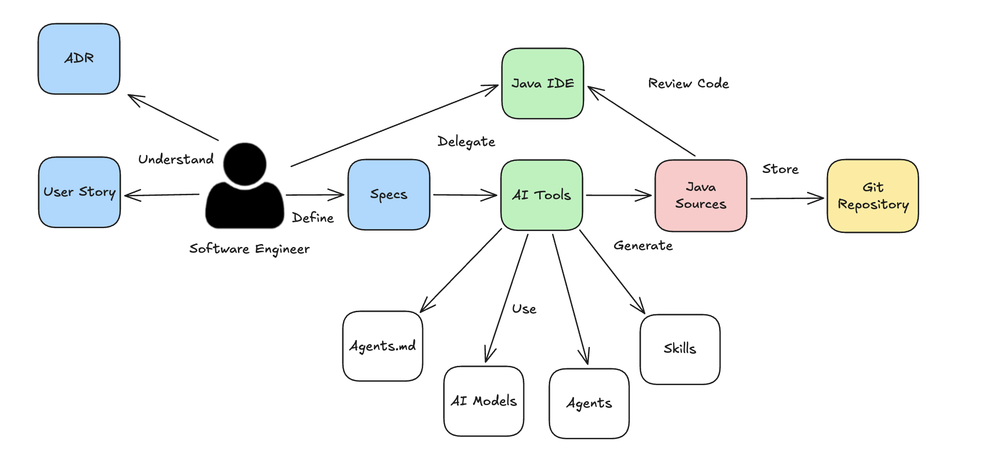
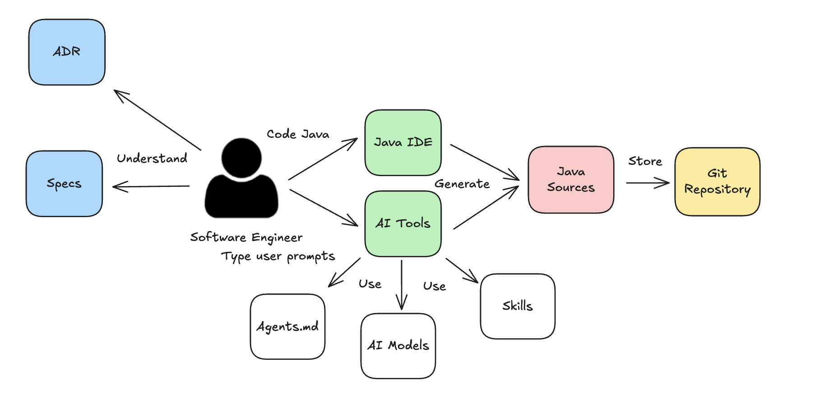
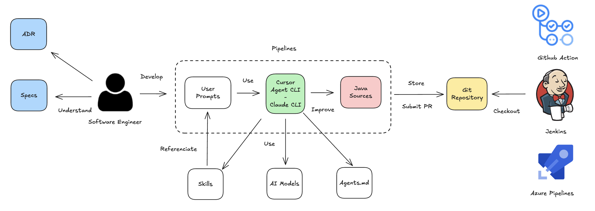

# Codemotion-madrid-2026-demos

A workshop designed to learn how to use AI Tooling like Cursor AI, Claude Code, Github Copilot or others

```
< Hello Codemotion Madrid 2026 >
 ------------------------------
        \   ^__^
         \  (oo)\_______
            (__)\       )\/\
                ||----w |
                ||     ||
```

## Prerrequsites

[SETUP.md](./docs/SETUP.md)

## Part 1: Concepts

- https://jabrena.github.io/cursor-rules-java/codemotion-madrid-2026/index.html

## Part 2: Practice

### Agent-driven Engineering Workflow (Demo I: 45)

Agents for Java Enterprise development were designed to help the Software engineer in the implementation phase. The software engineer define good Specs and that Specifications are delegated to Agents.



- Skills
- Agents
- Spec Driven

### Prompting Enginering Workflow (Demo II: 15)

In this workflow, the Software engineer interact with models using User prompts and in an incremental way you delegate a delegate completely a task or ask help in certain moments. You could use this project to refactor the code generated or delegate the task and associate a System prompt / Skills to that task.



#### Basics

**Review CLI Products:**

[CLI Details](./docs/CLI-DETAILS.md)

**Cursor AI Desktop:**

- AGENTS.md
- Autocomplete: Tab model
- Modes (Ask, Agent & Plan)

### CI/CD Pipeline Workflow (Demo III: 15)

Adding AI tools to your pipeline can provide new opportunities to deliver more value (examples: automatic coding, code refactoring, continuous profiling, and others).



- Enhancing CI/CD pipelines with AI Tooling

## References

- https://agents.md/
- https://github.com/anthropics/skills
- https://agentskills.io/specification
- https://cursor.com/docs/context/skills
- https://github.com/agentskills/agentskills/tree/main/skills-ref
- https://github.com/jabrena/wjax25-demos
- https://github.com/jabrena/dvbe25-demos
- https://github.com/jabrena/101-cursor
- https://github.com/jabrena/cursor-rules-java
- https://conferences.codemotion.com/madrid
