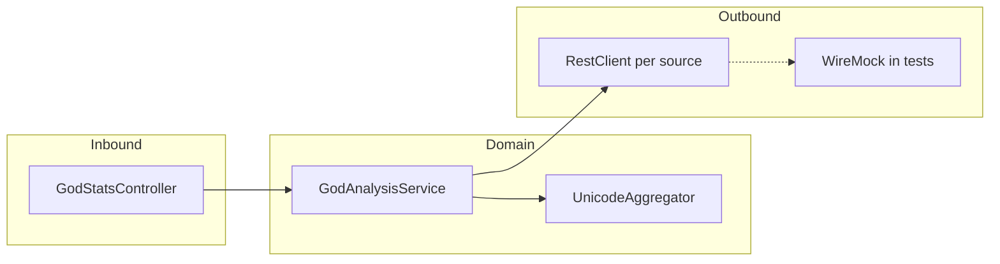

# US-001: God Analysis API — Implementation Plan

## Requirements Summary

**User Story:** Expose an HTTP API that aggregates god-name data from multiple pantheon sources, applies a case-insensitive first-character filter, computes a Unicode-based numeric sum per the contract, and returns the total as a decimal string—even when some sources fail or time out.

**Key Business Rules:**

- **Filtering:** Single-character `filter`; match the **first Unicode code point** of each name **case-insensitively** (agile docs + OpenAPI are authoritative; ADR-001 may still say “case-sensitive” in places—treat as stale).
- **Numeric rule:** For each name, for every code point, concatenate the decimal string of the code point, interpret the result as a **non-negative integer** (`BigInteger`), then **sum** across filtered names.
- **Resilience:** One attempt per outbound URL; **connect + read** timeouts from configuration; failed or omitted sources contribute **nothing**; HTTP **200** with **partial** aggregation when others succeed.
- **Contract:** `200` body uses generated `GodStatsSumResponse` (`sum` as string matching `^[0-9]+$`); errors use **`application/problem+json`** per OpenAPI.

**Acceptance / traceability:** [US-001_god_analysis_api.feature](../agile/US-001_god_analysis_api.feature), [US-001-god-analysis-api.openapi.yaml](../agile/US-001-god-analysis-api.openapi.yaml), ADRs [ADR-001](../adr/ADR-001-God-Analysis-API-Functional-Requirements.md)–[ADR-003](../adr/ADR-003-God-Analysis-API-Technology-Stack.md).

## Approach

**Strategy:** **London Style (outside-in) TDD** in strict order: start from acceptance behavior at the API boundary, drive controller delegation, then service orchestration, then outbound client implementation, and finally focused algorithm units and refactor/verification gates per slice.

**Stack constraints:** Spring Boot **MVC** (servlet), **`RestClient` only** (no WebFlux), parallel work via `CompletableFuture` with a **virtual-thread** executor, HTTP tests with **`RestClient`** against `@SpringBootTest(webEnvironment = RANDOM_PORT)` and **WireMock** (not REST Assured), per ADR-003.

**Reference implementation:** Use [`demos/backup/problem1/implementation`](../../../backup/problem1/implementation) as a **package/layout** reference (`info.jab.ms`: `config`, `client`, `controller`, `service`, `algorithm`, `exception`) but **re-validate** algorithms and expectations against OpenAPI/Gherkin (backup `UnicodeAggregator` and some tests may not match the concatenation rule).

## Task List

| # | Task | Phase | TDD | Parallel | Status |
|---|------|-------|-----|----------|--------|
| 1 | Run OpenAPI Generator: `mvn -f demos/demo1/implementation/pom.xml compile` (or `generate-sources`); confirm `info.jab.ms.api` / `info.jab.ms.api.model` (`GodStatsSumResponse`, `PantheonSource`, etc.). | Setup | | A1 | |
| 2 | **RED:** `GodStatsControllerAT` first acceptance contract: `@SpringBootTest(webEnvironment = RANDOM_PORT)`, `RestClient` to `http://localhost:{port}`, `@Tag("acceptance-test")`; start with one happy-path scenario from [feature file](../agile/US-001_god_analysis_api.feature). | RED | Test | A1 | |
| 3 | **GREEN:** Add minimal `GodStatsController` endpoint and delegation shape returning generated `GodStatsSumResponse`; create minimal `BadRequestException` and `GlobalExceptionHandler` stubs only as needed for test compilation. | GREEN | Impl | A1 | |
| 4 | **RED:** Controller-slice tests for query validation and error mapping (`filter`/`sources` missing or invalid) aligned with `@error-handling` in feature file. | RED | Test | A1 | |
| 5 | **GREEN:** Complete boundary behavior: 400 mapped as `application/problem+json`; controller delegates only and does not embed orchestration logic. | GREEN | Impl | A1 | |
| 6 | **Verify:** API boundary tests green (`GodStatsControllerAT` + controller-slice tests). | Verify | | A1 | |
| 7 | **RED:** `GodAnalysisServiceTest` for orchestration seam: `parseSources`, case-insensitive first-code-point filtering, partial results when one source fails, and deterministic aggregation behavior. | RED | Test | A2 | |
| 8 | **GREEN:** Implement `GodAnalysisService` with `CompletableFuture.supplyAsync(..., Executors.newVirtualThreadPerTaskExecutor())`, join/flatten/filter/sum, and source parsing with `BadRequestException` for invalid tokens. | GREEN | Impl | A2 | |
| 9 | **RED:** Outbound collaborator tests (`GodDataClient` / `PantheonDataSource`) using WireMock fixtures (`src/test/resources/wiremock`) and timeout/failure behavior. | RED | Test | A2 | |
| 10 | **GREEN:** Implement outbound adapters: `GodOutboundProperties`, `HttpClientConfig`, `RestClient` bean, and `GodDataClient` mapping JSON arrays to `GodData`; failures/timeouts contribute empty results. | GREEN | Impl | A2 | |
| 11 | **Verify:** Service + outbound tests green (`GodAnalysisServiceTest` and client tests). | Verify | | A2 | |
| 12 | **RED:** `UnicodeAggregatorTest` focused on the precise rule (`Zeus` → `90101117115`), ASCII + non-ASCII coverage, and stale “sum code points” prevention. | RED | Test | A3 | |
| 13 | **GREEN:** Implement `UnicodeAggregator` to concatenate decimal code points into `BigInteger`; clarify null/empty handling policy. | GREEN | Impl | A3 | |
| 14 | **GREEN:** Wire service to use real `UnicodeAggregator` values end-to-end so acceptance tests no longer rely on placeholders. | GREEN | Impl | A3 | |
| 15 | **Verify:** Algorithm + full acceptance path green; include timeout scenario as `*IT` (WireMock fixed delay > read timeout). | Verify | | A3 | |
| 16 | **Refactor:** Improve configuration/error handling consistency (timeouts, exception translation, response details) without changing behavior. | Refactor | | A4 | |
| 17 | **Verify:** Full build from repo root per [AGENTS.md](../../../../AGENTS.md): `mvn -f demos/demo1/implementation/pom.xml clean verify`; confirm `*Test`, `*IT`, `*AT` suites pass. | Verify | | A4 | |

**Parallel column:** `A1`–`A4` group strict outside-in slices (API boundary → service/outbound orchestration → algorithm completion → hardening). Use the same labels when splitting work across branches or agents.

## Execution Instructions

When executing this plan:

1. Complete the current task.
2. **Update the Task List:** set the **Status** column for that row (e.g. `Done` or `✔`) before starting the next task.
3. **For GREEN tasks:** complete the associated **Verify** step for that **Parallel** slice (A1–A4) before treating the slice as done.
4. **For Verify tasks:** ensure tests pass and the build succeeds before proceeding to the next slice.
5. **Verify** rows are London gates: finish API boundary first (A1), then service/outbound collaboration (A2), then domain algorithm completion (A3), then hardening/build (A4).
6. **Refactor phase** happens after behavior is green end-to-end (A4), unless a small earlier cleanup is required to keep tests readable.
7. Repeat for all tasks. **Do not** advance to the next numbered task without updating **Status** on the current one.

**Critical stability rules:**

- After every **GREEN** implementation task, run the relevant tests (or full `mvn test` for the module) before large refactors.
- If tests fail during **Verify**, fix the failure before moving on.
- Do not skip **Verify** rows—they keep the workshop demo runnable at each verification gate.

## File Checklist

Paths are under [`demos/demo1/implementation`](../../implementation) unless noted. Order follows London outside-in flow (acceptance/API boundary → service orchestration → outbound adapters → algorithm/domain → hardening).

| Order | File |
|-------|------|
| 1 | `pom.xml` (confirm OpenAPI input spec, Surefire patterns, dependencies) |
| 2 | `src/main/resources/application.yml` |
| 3 | `src/test/java/info/jab/ms/controller/GodStatsControllerAT.java` |
| 4 | `src/test/java/info/jab/ms/**/*IT.java` (timeout / integration scenario naming per `pom.xml`) |
| 5 | `src/main/java/info/jab/ms/controller/GodStatsController.java` |
| 6 | `src/main/java/info/jab/ms/exception/BadRequestException.java` |
| 7 | `src/main/java/info/jab/ms/controller/GlobalExceptionHandler.java` |
| 8 | `src/test/java/info/jab/ms/service/GodAnalysisServiceTest.java` |
| 9 | `src/main/java/info/jab/ms/service/GodAnalysisService.java` |
| 10 | `src/main/java/info/jab/ms/service/PantheonDataSource.java` |
| 11 | `src/main/java/info/jab/ms/service/InMemoryPantheonDataSource.java` |
| 12 | `src/main/java/info/jab/ms/service/GodData.java` |
| 13 | `src/test/resources/wiremock/*.json` (greek / roman / nordic stubs) |
| 14 | `src/main/java/info/jab/ms/config/GodOutboundProperties.java` |
| 15 | `src/main/java/info/jab/ms/config/HttpClientConfig.java` |
| 16 | `src/main/java/info/jab/ms/client/GodDataClient.java` |
| 17 | `src/main/java/info/jab/ms/client/OutboundCallObserver.java` (and `LoggingOutboundCallObserver.java` if used) |
| 18 | `src/main/java/info/jab/ms/client/OutboundSourceException.java` (if needed) |
| 19 | `src/test/java/info/jab/ms/algorithm/UnicodeAggregatorTest.java` |
| 20 | `src/main/java/info/jab/ms/algorithm/UnicodeAggregator.java` |
| 21 | `src/test/java/info/jab/ms/MainApplicationTest.java` |
| 22 | `src/main/java/info/jab/ms/Application.java` (component scan / bootstrap only) |

## Notes

- **Current codebase:** [`demos/demo1/implementation`](../../implementation) currently has only `Application.java`, `application.yml`, and `MainApplicationTest.java`; most files in the checklist are **to be added** following the backup layout.
- **Golden values:** Gherkin `sum` strings must match **exact** name lists in WireMock JSON; any drift changes the expected aggregate—lock fixtures under `src/test/resources` and use feature sums as regression targets.
- **Documentation debt:** After implementation, consider a one-line fix in ADR-001 so “case-sensitive” does not contradict code.
- **OpenAPI Generator:** Controller should use generated types for the response body to avoid drift from [`US-001-god-analysis-api.openapi.yaml`](../agile/US-001-god-analysis-api.openapi.yaml).

## Requirements source of truth (quick reference)

| Topic | Decision |
|--------|----------|
| Filtering | Case-insensitive first character (agile + OpenAPI; ADR-001 may be stale). |
| Decimal rule | Concatenate decimal digits per code point → one `BigInteger` per name → sum. |
| Resilience | Single attempt; timeouts; omit failed sources; partial sum, HTTP 200. |
| HTTP tests | Spring `RestClient` + WireMock; not REST Assured. |
