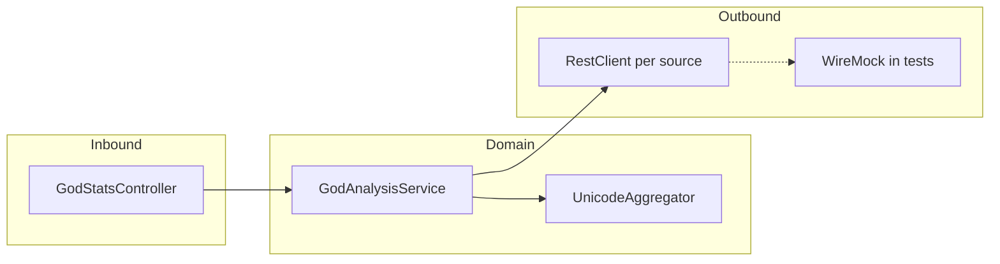

# US-001 God Analysis API — implementation plan

## Overview

Implement `GET /api/v1/gods/stats/sum` in [`demos/demo1/implementation`](../../implementation) per the OpenAPI contract and Gherkin scenarios: parallel RestClient fetches with timeouts (no retries), case-insensitive prefix filter, Unicode decimal concatenation per name, `sum` as a decimal string, and tests using Spring RestClient + WireMock per ADR-003.

## Requirements source of truth

| Topic | Decision |
|--------|----------|
| Filtering | **Case-insensitive** first character (see [US-001_God_Analysis_API.md](../agile/US-001_God_Analysis_API.md), [OpenAPI](../agile/US-001-god-analysis-api.openapi.yaml), [feature file](../agile/US-001_god_analysis_api.feature)). **Note:** [ADR-001](../adr/ADR-001-God-Analysis-API-Functional-Requirements.md) still says “case-sensitive” in one place—treat that as stale; align code with agile/OpenAPI. |
| Decimal rule | Per character: Unicode code point → decimal digits **concatenated** into one string; that string is interpreted as a **non-negative integer** (`BigInteger`); **sum** those per-name values ([OpenAPI description](../agile/US-001-god-analysis-api.openapi.yaml)). |
| Resilience | One HTTP attempt per source; **connect + read** timeouts from config; on failure/timeout, **omit** that source and aggregate the rest ([ADR-002](../adr/ADR-002-God-Analysis-API-Non-Functional-Requirements.md)). |
| Stack | Spring Boot **MVC** (servlet), **RestClient** only (no WebFlux), parallel work via `CompletableFuture` + **virtual-thread** executor ([ADR-003](../adr/ADR-003-God-Analysis-API-Technology-Stack.md)). |
| HTTP tests | **Spring `RestClient`** against `@SpringBootTest(webEnvironment = RANDOM_PORT)`; **WireMock** for delays/isolation—**not** Rest Assured ([ADR-003](../adr/ADR-003-God-Analysis-API-Technology-Stack.md)). |

## Current codebase

- [`demos/demo1/implementation/pom.xml`](../../implementation/pom.xml) already wires **OpenAPI Generator** (`inputSpec` → [`US-001-god-analysis-api.openapi.yaml`](../agile/US-001-god-analysis-api.openapi.yaml)), `wiremock-standalone`, and Surefire includes `*Test`, `*IT`, `*AT`.
- Main code is only [`Application.java`](../../implementation/src/main/java/info/jab/ms/Application.java); [`application.yml`](../../implementation/src/main/resources/application.yml) has outbound URLs and `5s` timeouts.
- Use [`demos/backup/problem1/implementation`](../../../backup/problem1/implementation) as a **package/layout reference** (same `info.jab.ms` tree: `config`, `client`, `controller`, `service`, `algorithm`, `exception`) but **re-validate** algorithm and tests against OpenAPI/Gherkin (backup’s `UnicodeAggregator` and some unit expectations do not match the concatenation rule).

## Implementation steps

### 1. Generate and adopt OpenAPI boundary types

- Run `mvn -f demos/demo1/implementation/pom.xml compile` (or `generate-sources`) so `info.jab.ms.api` / `info.jab.ms.api.model` types exist (`GodStatsSumResponse`, `PantheonSource` enum, etc.).
- Implement **`GET /api/v1/gods/stats/sum`** in a `@RestController` using generated **`GodStatsSumResponse`** for `200` JSON (`sum` as `String` matching `^[0-9]+$`).

### 2. Configuration and RestClient bean

- Add `@ConfigurationProperties` (e.g. `GodOutboundProperties`) binding `god.outbound` from [`application.yml`](../../implementation/src/main/resources/application.yml): `connect-timeout`, `read-timeout`, per-pantheon URLs (already present).
- Register a **`RestClient`** `@Bean` (e.g. `@Qualifier("godOutboundRestClient")`) using `JdkClientHttpRequestFactory` + `java.net.http.HttpClient` with **connect** and **read** timeouts from properties (pattern from backup [`HttpClientConfig`](../../../backup/problem1/implementation/src/main/java/info/jab/ms/config/HttpClientConfig.java)).

### 3. Unicode aggregation (core algorithm)

- Implement `UnicodeAggregator` as: for each Unicode code point in the name, append `Integer.toString(codePoint)` to a `StringBuilder`, then `new BigInteger(builder.toString())`. Reject null/empty names if needed for clarity.
- **Unit tests** (`UnicodeAggregatorTest`): replace expectations that sum code points; assert e.g. `Zeus` → `90101117115` as `BigInteger`, plus ASCII/non-ASCII cases.

### 4. Outbound data access

- **`GodDataClient`** (implements `PantheonDataSource`): `RestClient.get()` each configured URL; deserialize JSON as **`List<String>`** (array of god names), matching fixtures under [`src/test/resources/wiremock`](../../implementation/src/test/resources/wiremock) and live Typicode shape.
- Map each name to `GodData(name, unicodeAggregator.toBigInteger(name))`.
- On `RestClientException` / timeout: catch and convert to empty list or let service layer treat as empty contribution (same observable behavior: **partial sum**, HTTP **200**).

### 5. Orchestration in `GodAnalysisService`

- **`parseSources(String)`**: split on comma, trim, reject **empty** `sources` or empty tokens, map to `PantheonSource` (generated enum); invalid → `BadRequestException` (400).
- **`aggregateByFilter`**: validate `filter` length == 1 in controller or service; filter names where **first code point** matches `filter` **ignoring case** (e.g. compare `Character.toUpperCase` of both).
- **Parallelism**: `CompletableFuture.supplyAsync(..., Executors.newVirtualThreadPerTaskExecutor())` per selected source, then `join`, flatten, filter, sum with `BigInteger`.
- Ensure **ordering** of sources does not change the sum (use sorted source order when iterating futures if you need deterministic logging only; set semantics for duplicates already handled in backup).

### 6. Error handling vs OpenAPI

- OpenAPI specifies **`application/problem+json`** for 400/500 (`ProblemDetail` schema). Prefer Spring **`ProblemDetail`** + `@RestControllerAdvice` returning `ResponseEntity<ProblemDetail>` with `Content-Type` `application/problem+json`, **or** document a minimal mapping (title/detail/status) compatible with the schema’s fields.
- Map **`BadRequestException`** to **400**; missing required query parameters should also yield **400** (Spring MVC default or explicit checks).

### 7. Observability (light)

- Optional structured logs on per-source start/success/failure (aligns with [ADR-002](../adr/ADR-002-God-Analysis-API-Non-Functional-Requirements.md) “log outcomes”).
- Add **`spring-boot-starter-actuator`** only if you want `/health` out of the box; otherwise skip to keep the module minimal.

### 8. Tests (traceability to feature file)

| Layer | Scope |
|--------|--------|
| **Unit** | `UnicodeAggregatorTest`; `GodAnalysisServiceTest` (parseSources, case-insensitive filter, BigInteger sum order-independence, fallback when a source throws). Use **`InMemoryPantheonDataSource`** or stubs with **values computed from the real algorithm** (not hand-waved constants unless they match the formula). |
| **Acceptance / black-box** | Class e.g. `GodStatsControllerAT`: `@SpringBootTest(webEnvironment = RANDOM_PORT)`, build `RestClient` to `http://localhost:{port}`, **`@Tag("acceptance-test")`** for scenarios matching `@acceptance-test` in the [feature file](../agile/US-001_god_analysis_api.feature). Stub WireMock with the **same name lists** as the feature’s expected aggregates; **recompute** expected `sum` strings with the **concatenation** rule (golden values: `78179288397447443426` and `78101109179220212216` from the feature—verify against your stub JSON). |
| **Integration** | `@Tag("integration-test")` or `*IT`**: WireMock **fixed delays** > read timeout on Roman+Nordic paths; assert partial sum per the integration scenario in the feature file. Reset WireMock in `@BeforeEach`. |
| **Error paths** | 400 for missing `filter`/`sources`, empty filter, multi-char filter, empty/invalid `sources`—align with `@error-handling` in the feature file. |

### 9. Build verification

- From repo root (per [AGENTS.md](../../../../AGENTS.md)): `mvn -f demos/demo1/implementation/pom.xml clean verify` (or project-standard command) after implementation.

## Risk / attention points

- **Golden numbers** in the Gherkin file must match **exact** JSON name lists from Typicode (or identical WireMock bodies). If any name list drifts, expected `sum` changes—lock test data in WireMock JSON files under `src/test/resources` and treat the feature file sums as regression targets.
- **ADR-001 vs agile**: implement **case-insensitive** behavior; consider a one-line ADR-001 fix later so docs match code.

## Implementation checklist

- [ ] Run OpenAPI Generator (`mvn compile`) and wire controller DTOs to generated `GodStatsSumResponse` / enums
- [ ] Add `GodOutboundProperties` + `JdkClientHttpRequestFactory` `RestClient` bean with connect/read timeouts
- [ ] Implement `UnicodeAggregator` (concatenate decimal code points), `GodDataClient`, `GodAnalysisService` (virtual-thread parallel fetch, case-insensitive filter, partial results)
- [ ] Global exception handling: 400/500 aligned with Problem Detail / OpenAPI
- [ ] Unit + `GodStatsControllerAT` (RestClient + WireMock) + integration timeout scenario; `@Tag` acceptance-test / integration-test; `mvn verify`
